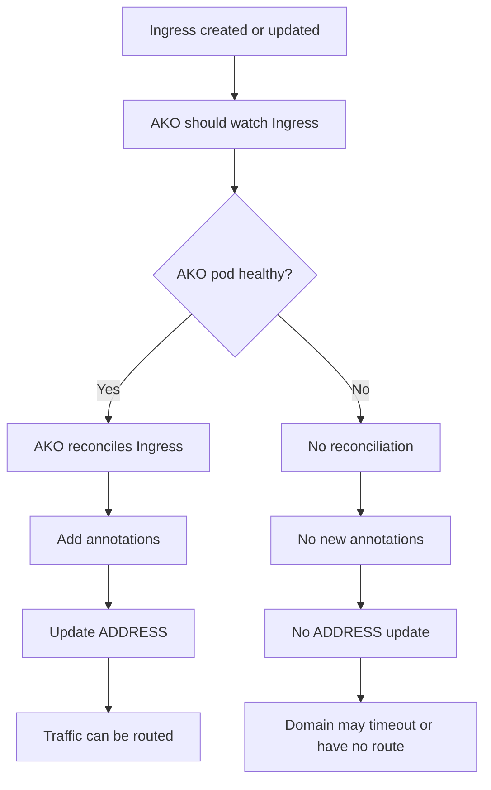
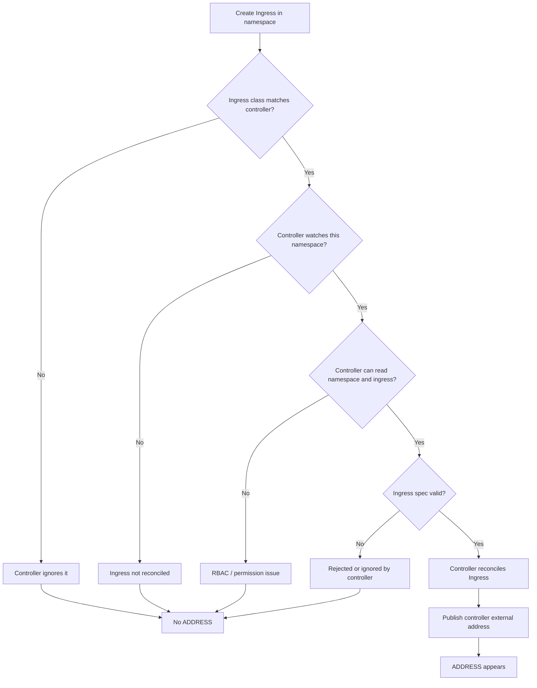
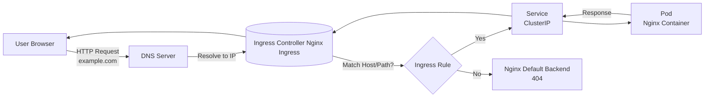

## 📥 收集區（先丟進來就好）

### 內容／片段

- VMware AKO(Avi) as Ingress Controller
  -

- kubectl 網路拓樸







- kubectl 常用指令

```shell
kubectl config set-context --current --namespace={ns} # 設定預設命名空間
```

### 來源

- 連結：

- 截圖／檔案：

### 關鍵字（你之後會怎麼找回來？）

-

---

## 🧹 整理區（有空才做）

### 這段片段可以變成什麼？

- 可重做的步驟（操作指南）

- 可重用的 code（程式片段）

- 一句話理解（概念）

### 下一次要做的最小整理

- [ ] 補一句摘要

- [ ] 加 1–3 個 Tag

- [ ] 設定重要度

- [ ] 決定要不要勾精選
