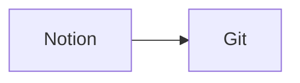

## 🎯 目標（你要達成什麼）

- 同步Notion筆記到Git Hub Repos，重新建置Hugo WebStie

## ✅ 成功標準（怎樣算完成）

- [ ] 使用Notion API抓取DataBase → Page 內容

- [ ] GitHub Action設置

## 🏗️ 架構與資料流

## 📌 核心內容

### 主要想法／問題

- GitHub action Debug，使用 Linux act package 模擬
  - Docker-in-Docker

  -

-

## 🧾 變更紀錄

- 2026-03-04：建立筆記框架

## 🔗 參考連結

-
