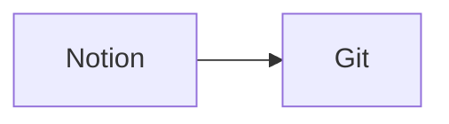

## 🎯 目標（你要達成什麼）

- 同步Notion筆記到Git Hub Repos，重新建置Hugo WebStie

## ✅ 成功標準（怎樣算完成）

- [x] 使用Notion API抓取DataBase → Page 內容

- [ ] GitHub Action設置

## 🏗️ 架構與資料流



## 📌 核心內容

### 主要想法／問題

- git worktree
  - 用於同一個repos，在不同資料夾checkout

- Secret and Variables設置
  - settings → Secrets and variables
    - Environment level
      - 作用範圍: 特定環境，需在工作流指定環境才能存取

      - 使用情境: 覆寫 Repos level的變數

      - 安全機制:
        - 存取前需要人工審核

      - 可限制特定分支或條件才可以使用

    - **Repository level**
      - 作用範圍: 整個Repos

      -  使用情境: 共用設定，例如 Notion Token、Notion Database Id

      - 不需要在 workflow 額外指定 environment 就能使用

| 項目 | Repos Secrets/ Variables | Environment Secrets/ Variables |
| --- | --- | --- |
| 範圍 | 整個 Repos | 指定Env (dev / UAT/ Prod) |
| 使用方式 | 整個 Workflow | 指定 env 的 job 可使用 |
| 安全控制 | X | 高(可設定審核) |
| 存取控制 | X | 高(針對各環境做設置) |
| 使用情境 | 共用設定 | 部屬專用設定 |
| 覆蓋機制 | 預設值 | 可覆蓋 Repos 層級的設定 |

- Git Hub runner
  - 每次都是新的

  - 跑完就丟掉

  - 不會保留上一次狀態

- GitHub action 設置
  - Commits pushed by a GitHub Actions workflow that uses the GITHUB_TOKEN do not trigger a GitHub Pages build.
    - [https://docs.github.com/actions/concepts/security/github_token](https://docs.github.com/actions/concepts/security/github_token)

```yaml
name: ${工作流名稱}

on:
  workflow_dispatch: # 在GitHub UI可手動觸發
  schedule:
    - cron: "0 17 * * *" # 分 時 日 月 週 (UTC) 代表 台灣時間 1:00 (24HR)

# 控制工作流可以寫入 Repos，commit files、push branch、update file in repos
permissions:
  contents: write 

# 定義工作流
jobs:
  sync: #工作名稱
    runs-on: ubuntu-latest #執行環境
    env: # 全部步驟可存取的環境變數
      # secrets設定，settings -> Secrets and variables -> secret(上方)、variable(下方)
      TOKEN: ${{ secrets.TOKEN }}
      ID: ${{ vars.ID }}
      OUTPUT: ${{ vars.OUTPUT }}
      
    steps: 
      - name: Checkout repository # 步驟名稱
        uses: actions/checkout@v4 # <owner>/<repo>@<version> official checkout action.
        with:
          ref: dev # 設定參考分支，後續步驟都會執行在此分支上
          fetch-depth: 0 # 預設clone可能只下載最後一次的commit紀錄，0代表下載全部
          submodules: recursive # 下載子模組
          
      - name: Setup Node.js 
        uses: actions/setup-node@v4 # 安裝 nodejs
        with:
          node-version: 20 # 指定版本
          cache: npm # 快取npm，用於加速下次執行
          
      - name: Setup Hugo
        uses: peaceiris/actions-hugo@v3 # <owner>/<repo>@<version>
        with:
          hugo-version: "0.150.0" # 指定 hugo version
          extended: true # 安裝 Hugo 擴充套件 ，SCSS、SCSS、 others static assets file process

      - name: Install dependencies
        run: npm ci # 安裝相依套件
        
      - name: Sync Notion content 
        run: node ./scripts/notion-fetch.mjs # 執行mjs腳本，同步 Notion內容
        
      - name: Commit synced source changes to dev
        id: commit_source # 設定一個ID，之後用於除錯這個Step
        shell: bash
        run: |
          git config user.name "github-actions[bot]"
          git config user.email "41898282+github-actions[bot]@users.noreply.github.com"
          git checkout dev
          git add content
          if git diff --cached --quiet; then
            echo "changed=false" >> "$GITHUB_OUTPUT"
            exit 0
          fi
          git commit -m "chore: sync notion content"
          git push origin dev
          echo "changed=true" >> "$GITHUB_OUTPUT"
          
      - name: Build Hugo site
        run: hugo --minify # 建置
        
      - name: Deploy public site to master
        shell: bash
        run: |
          git config user.name "github-actions[bot]"
          git config user.email "41898282+github-actions[bot]@users.noreply.github.com"
          git fetch origin master
          rm -rf .deploy_worktree
          git worktree add -B master .deploy_worktree origin/master
          find .deploy_worktree -mindepth 1 -maxdepth 1 ! -name ".git" ! -name ".github" -exec rm -rf {} +
          cp -R public/. .deploy_worktree/
          cp README.md .deploy_worktree/README.md
          git -C .deploy_worktree add -A
          if git -C .deploy_worktree diff --cached --quiet; then
            echo "No site changes to deploy"
            exit 0
          fi
          git -C .deploy_worktree commit -m "build site_$(date -u +'%Y-%m-%d.%H%M')"
          git -C .deploy_worktree push origin master
          
      - name: Cleanup worktree
        if: always()
        shell: bash
        run: |
          if [ -d .deploy_worktree ]; then
            git worktree remove .deploy_worktree --force || true
          fi
```

## **notion-fetch.mjs 的實際行為**

- `NOTION_ID` 可以是 Notion Page Id，也可以是 Database Id

- 如果是 `Page Id`
  - 會輸出單一 Markdown 檔

  - 輸出位置由 `OUTPUT_PATH` 控制

- 如果是 `Database Id`
  - 會查詢整個 Database

  - 只有 `SyncToGit = true` 的頁面會被同步

  - `HugoArchives` 必須是 `bike`、`note`、`post` 其中之一

  - 會直接寫入 `content/bikes`、`content/notes`、`content/posts`

  - 不會再額外產出 sync report 檔

## **建議的 Secrets / Variables**

- `Secrets`
  - `NOTION_TOKEN`

- `Variables`
  - `NOTION_ID`

  - `OUTPUT_PATH`

  - `HUGO_CONTENT_ROOT`

## 備註

- `OUTPUT_PATH` 只在單一 Page 同步模式有作用

- Database 同步模式主要輸出是 Hugo 文章檔案，不是 report

- GitHub runner 是一次性的，每次 workflow 執行都會重新建立環境

## 🔗 參考連結

- [https://github.com/peaceiris/actions-gh-pages](https://github.com/peaceiris/actions-gh-pages)

- [https://github.com/peaceiris/actions-hugo](https://github.com/peaceiris/actions-hugo)
